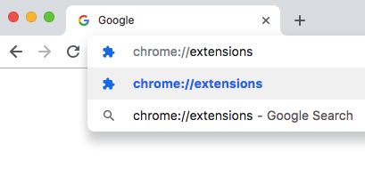
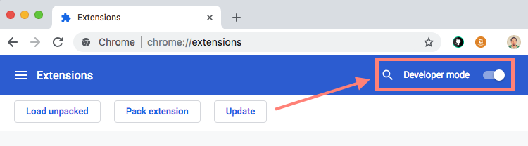
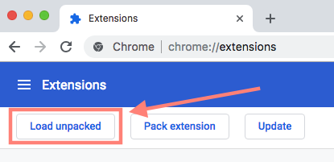
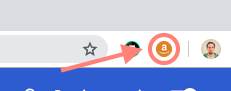

# Amazon UY

Chrome extension that shows you relevant information to Amazon's consumers, adding additional information like weight in kilos per item, plus shipment cost based on a specific supplier here in Uruguay, showing an approximate value to the  REAL cost UY people pay while making an Amazon purchase.

## Setup

```sh
npm install
```

## Build
To generate the code with all the files needed just run:

```sh
npm run build
```

This will generate a `/build` folder, containing the chrome extension's code to be loaded in the browser.

## Compress
To generate a zip file with the chorme extension files, just run:

```sh
npm run zip
```

This will re-build the code and create the distribution folder. The `/dist` folder, will contain a zipfile with the generated code.

## Development

While updating or adding changes to this extensions, just run:

```sh
npm start
```

This will watch the `/app` folder for changes, and each time you change a file, it'll do an `npm run build` to reflect the changes in the build folder. You'll need to have Chrome pointing to this directory in order to see the changes reflected in the browser.

## Install Extension

1. Clone this repo to your own computer.

2. Open the terminal, go to the repo folder, and type `npm install`.

3. Once you installed all the dependencies, you'll need to build the extension by doing `npm run build`.

4. Now that you have the chrome extension built, open Google Chrome. and navigate to **chrome://extensions**



5. Enable the 'Developer mode'.



6. Click “Load Unpacked Extension” button.



7. Navigate to the local folder where you have this project, and point to the `/build` folder, which contains the generated extension’s code and click OK.

8. DONE! The extension is now available to use.



Enjoy it.
